# Altynx | HealthTech & Life Sciences
### Secure Patient Data and AI-Driven Diagnostic Ecosystem

---

  &nbsp;   &nbsp;  

```mermaid
graph LR
    %% Advanced CSS Styling for Smoothness and Color
    classDef userGateway fill:#0f172a,stroke:#38bdf8,stroke-width:2px,color:#fff,rx:20,ry:20;
    classDef coreApp fill:#1e1b4b,stroke:#818cf8,stroke-width:2px,color:#fff,rx:20,ry:20;
    classDef aiEngine fill:#4c0519,stroke:#f43f5e,stroke-width:2px,color:#fff,rx:20,ry:20;
    classDef cloudInfra fill:#064e3b,stroke:#34d399,stroke-width:2px,color:#fff,rx:20,ry:20;
    classDef dataLayer fill:#422006,stroke:#fb923c,stroke-width:2px,color:#fff,rx:20,ry:20;
    
    %% Link Styling (Sleek grey paths)
    linkStyle default stroke:#64748b,stroke-width:2px,fill:none;

    %% Free-floating Nodes with HealthTech Icons
    Patient(["fa:fa-mobile-screen Patient App"]):::userGateway
    Doctor(["fa:fa-stethoscope Clinician Portal"]):::userGateway
    API(["fa:fa-network-wired FHIR API Gateway"]):::userGateway
    
    Core(["fa:fa-notes-medical Core EHR System"]):::coreApp
    Data(["fa:fa-database Interoperability Layer"]):::coreApp
    
    AI(["fa:fa-brain AI Diagnostics"]):::aiEngine
    Predict(["fa:fa-heart-pulse Predictive Analytics"]):::aiEngine
    
    Cloud(["fa:fa-cloud HIPAA Compliant Cloud"]):::cloudInfra
    Security(["fa:fa-shield-halved Zero-Trust Security"]):::cloudInfra
    
    CRM(["fa:fa-users Salesforce Health"]):::dataLayer
    Vault(["fa:fa-lock Encrypted Patient Data"]):::dataLayer

    %% Flow Path Connections
    Patient == "TLS 1.3" ==> API
    Doctor == "Secure Auth" ==> API
    API -. "Verify" .-> Security
    API ==> Core
    Core ==> Data
    Data ==> AI
    AI -. "Live Vitals" .-> Predict
    Core ==> Cloud
    Cloud ==> CRM
    CRM ==> Vault
    Predict ==> Vault
```

This repository serves as a mission-critical engineering showcase by **Altynx**. It demonstrates a unified approach to modern healthcare technology, focusing on data interoperability, regulatory compliance, and intelligent patient outcomes.

---

### 1. Custom Software Engineering
**Healthcare Management Systems**

   

Engineering secure patient data platforms and internal healthcare tools designed for operational workflows and data centralization.

### 2. AI and Neural Frameworks
**Intelligent Diagnostics**

   

Developing AI-powered systems for fraud detection in insurance claims and predictive modeling for patient health outcomes.

### 3. Cloud and Infrastructure Engineering
**Secure and Scalable Infrastructure**

   

Designing cloud-native environments that meet global healthcare standards (HIPAA/GDPR) with high-availability system design.

### 4. DevOps and Automation Excellence
**Reliable Deployment Pipelines**

   

Automated security protocols and deployments ensuring that life-critical systems remain online and secure during updates.

### 5. Web and Mobile App Engineering
**Patient and Clinician Interfaces**

   

Building high-performance portals for clinicians and secure mobile applications for patient remote monitoring.

### 6. CRM and Data Intelligence
**Unified Patient Lifecycle**

  

Integrating customer-centric systems to improve patient engagement and centralize healthcare operational data.

### 7. Elite Staff Augmentation
**Technical Squad Deployment**

  

Providing specialized engineers to accelerate healthcare transformation projects through professional squad deployment.

---

### Legal and Intellectual Property
Copyright © 2026 **Altynx**. All rights reserved. 

The architecture, code patterns, and methodologies contained within this repository are the exclusive proprietary property of Altynx. Unauthorized reproduction is prohibited.

---
### Contact Information
Inquiries: [info@altynx.com](mailto:info@altynx.com)  
Official Website: [altynx.com](https://altynx.com)
